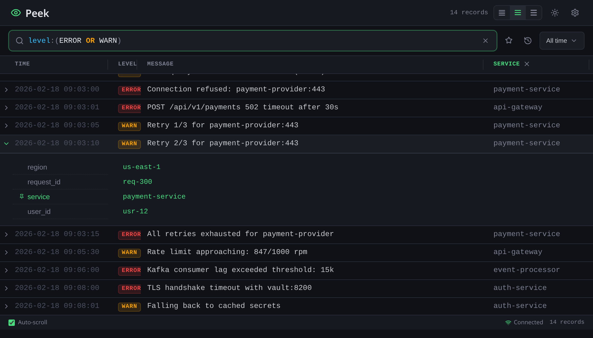

# Peek

[](https://github.com/mchurichi/peek/actions/workflows/ci.yml)

A minimalist, dev-first CLI log collector and web UI. Pipe logs into `peek`, store them locally, and query them through a real-time web dashboard.

```bash
$ kubectl logs -l app=frontdesk -w | peek

2026/02/18 02:30:20 Starting collect mode...
2026/02/18 02:30:20 Web UI available at http://localhost:8080
2026/02/18 02:30:20 Starting server on http://localhost:8080
```



## Features

- 🚀 **Single binary** - No external dependencies
- 📊 **Structured log support** - Auto-detects JSON and logfmt (key-value) formats
- 💾 **Local storage** - BadgerDB with configurable retention
- 🔍 **Lucene queries** - Powerful search syntax
- ⚡ **Real-time updates** - WebSocket streaming
- 🎨 **Web UI** - Clean, minimal interface
- ⚙️ **Configurable** - TOML config + CLI flags

## Installation

```bash
# Build from source
git clone https://github.com/mchurichi/peek.git
cd peek
go build -o peek ./cmd/peek

# Or install directly
go install github.com/mchurichi/peek/cmd/peek@latest
```

## Quick Start

### Collect & View in Real Time (Fresh Mode)

Pipe logs from any source — the web UI starts automatically and shows only logs from the current session:

```bash
# From a file (fresh mode - only shows logs from this session)
cat application.log | peek

# From a running process
docker logs my-container | peek

# From kubectl
kubectl logs my-pod -f | peek

# With a custom port
kubectl logs my-pod -f | peek --port 8081

# Show all historic logs alongside new ones
kubectl logs my-pod -f | peek --all
```

The browser auto-opens to `http://localhost:8080`. Logs stream to the UI in real time via WebSocket. 

**Fresh Mode (default)**: By default, the UI only shows logs from the current piping session. Historic logs in the database are filtered out. This is ideal for live debugging.

**All Mode (`--all`)**: Use the `--all` flag to see all stored logs alongside newly piped ones.

After stdin closes, the server stays alive so you can keep browsing — press `Ctrl+C` to exit.

### Browse Previously Collected Logs

Start the web UI in standalone server mode to browse all stored logs:

```bash
peek server
```

### Database Management

View and manage your log database:

```bash
# Show database statistics
peek db stats

# Delete all logs (with confirmation)
peek db clean

# Delete all logs (skip confirmation)
peek db clean --force

# Delete logs older than 7 days
peek db clean --older-than 7d --force

# Delete only DEBUG level logs
peek db clean --level DEBUG --force
```

## Usage

### Collect Mode

Collects logs from stdin and starts an embedded web UI for real-time viewing:

```bash
cat app.log | peek [OPTIONS]

Options:
  --all                  Show all historic logs alongside new ones (default: fresh mode)
  --config FILE          Path to config file (default: ~/.peek/config.toml)
  --db-path PATH         Database path (default: ~/.peek/db)
  --retention-size SIZE  Max storage (e.g., 1GB, 500MB)
  --retention-days DAYS  Max age of logs (default: 7)
  --format FORMAT        auto | json | logfmt (default: auto)
  --port PORT            HTTP port for embedded web UI (default: 8080)
  --no-browser           Don't auto-open browser
  --help                 Show help
```

### Server Mode

Browse previously collected logs (no stdin required):

```bash
peek server [OPTIONS]

Options:
  --config FILE      Path to config file (default: ~/.peek/config.toml)
  --db-path PATH    Database path (default: ~/.peek/db)
  --port PORT       HTTP port (default: 8080)
  --no-browser      Don't auto-open browser
  --help             Show help
```

### Database Management

Manage your log database:

```bash
# Show database statistics
peek db stats [OPTIONS]

# Delete logs from database
peek db clean [OPTIONS]

Options for 'db stats':
  --config FILE      Path to config file (default: ~/.peek/config.toml)
  --db-path PATH     Database path (default: ~/.peek/db)

Options for 'db clean':
  --config FILE          Path to config file (default: ~/.peek/config.toml)
  --db-path PATH         Database path (default: ~/.peek/db)
  --older-than DURATION  Delete logs older than duration (e.g., 24h, 7d, 2w)
  --level LEVEL          Delete only logs matching level (e.g., DEBUG)
  --force                Skip confirmation prompt
```

**Examples:**

```bash
# View database info
peek db stats
# Output:
# Database Statistics
# ===================
# Path:          /home/user/.peek/db
# Total logs:    14,382
# Database size: 238.45 MB
# Oldest entry:  2026-02-01T10:30:45Z
# Newest entry:  2026-02-18T22:15:30Z

# Delete all logs (with confirmation)
peek db clean

# Delete all logs (skip confirmation)
peek db clean --force

# Delete logs older than 7 days
peek db clean --older-than 7d --force

# Delete only DEBUG level logs
peek db clean --level DEBUG --force
```

## Query Syntax

Peek supports ElasticSearch Lucene query syntax:

```
# Keyword search
error timeout

# Field-based queries
level:ERROR
service:api
user_id:123

# Boolean operators
level:ERROR AND service:api
level:ERROR OR level:WARN
NOT level:DEBUG

# Wildcards
message:*timeout*
service:api*

# Quoted phrases
message:"connection refused"

# Complex queries
(level:ERROR OR level:CRITICAL) AND service:api
```

## Log Formats

Peek supports structured log formats with auto-detection. The JSON parser accepts common field names (`timestamp`/`time`, `message`/`msg`, `level`/`severity`).

### JSON
```json
{
  "timestamp": "2026-02-17T10:30:45Z",
  "level": "ERROR",
  "message": "Connection timeout",
  "service": "api",
  "attempt": 3
}
```

### Logfmt (key-value pairs)
```
time=2026-02-17T10:30:45Z level=ERROR msg="Connection timeout" service=api attempt=3
```

## Configuration

Default config location: `~/.peek/config.toml`

```toml
[storage]
retention_size = "1GB"
retention_days = 7
db_path = "~/.peek/db"

[server]
port = 8080
auto_open_browser = true

[parsing]
format = "auto"
auto_timestamp = true
```

CLI flags override config file values.

## Architecture & API

Peek runs as a single process that reads stdin, stores logs locally, and serves a web UI.
Full architecture and API details are in [docs/README.md](docs/README.md).

## Examples

### Collect and view in real time

```bash
# Collect + view in one command
kubectl logs my-pod -f | peek --port 8081

# Browse logs after collection ends
peek server

# Collect more logs (same database)
cat another-app.log | peek
```

### Filter and search

```bash
# In the web UI:
level:ERROR                    # Show only errors
service:api                    # Filter by service
level:ERROR AND service:auth   # Combine filters
message:*timeout*              # Wildcard search
```

## Development

### Requirements

- Go 1.21+
- BadgerDB v4
- Gorilla WebSocket

### Build

```bash
go build -o peek ./cmd/peek
```

### Project Structure

```
peek/
├── cmd/peek/           # Main entry point
├── pkg/
│   ├── parser/         # Log format parsers
│   ├── storage/        # BadgerDB storage layer
│   ├── query/          # Lucene query engine
│   └── server/         # HTTP server & WebSocket
├── internal/
│   ├── config/         # Configuration management
│   └── web/            # Web UI (embedded)
└── go.mod
```

## Performance & Roadmap

Performance notes and the roadmap live in [docs/README.md](docs/README.md).

## Contributing

Contributions welcome! Please open an issue first to discuss changes.

## License

Apache-2.0 - see [LICENSE](LICENSE) for details

## Credits

Built with:
- [BadgerDB](https://github.com/dgraph-io/badger) - Embedded key-value database
- [Gorilla WebSocket](https://github.com/gorilla/websocket) - WebSocket library
- [BurntSushi/toml](https://github.com/BurntSushi/toml) - TOML parser

---

**Local-first. Security-first. Minimal. Modular.**
